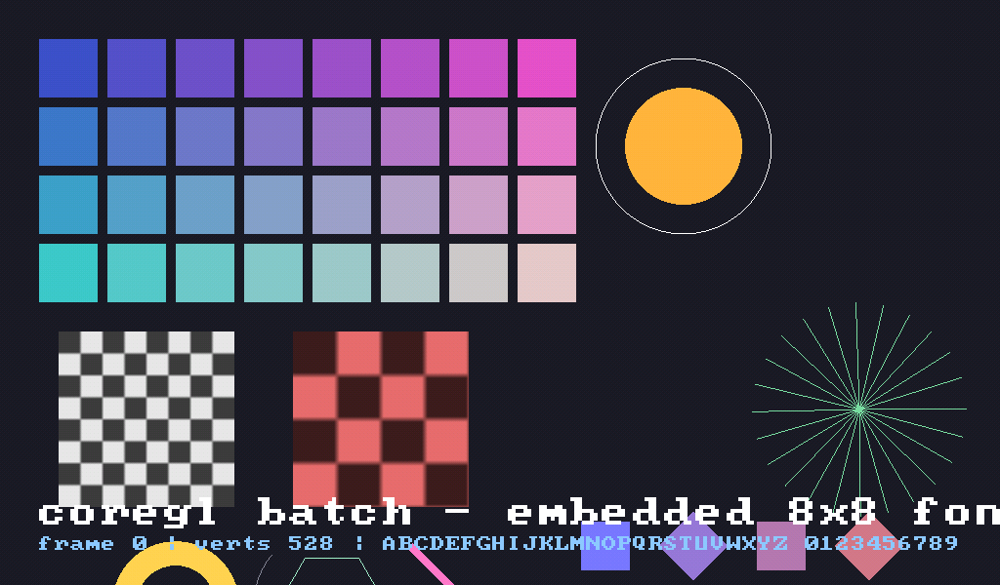
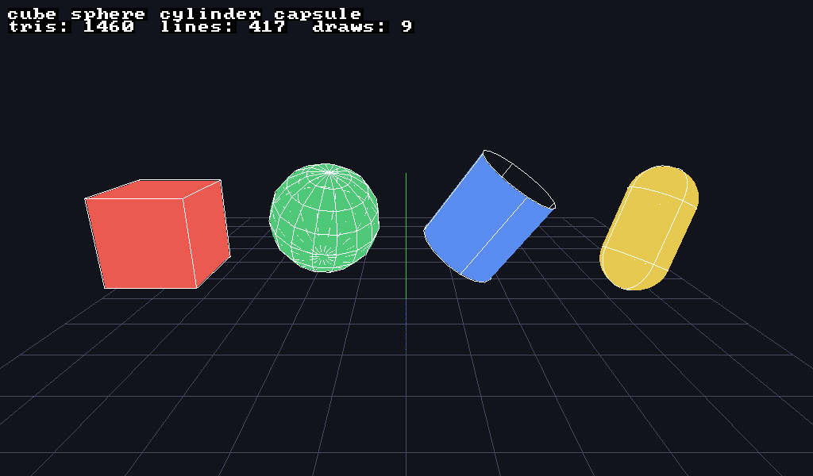
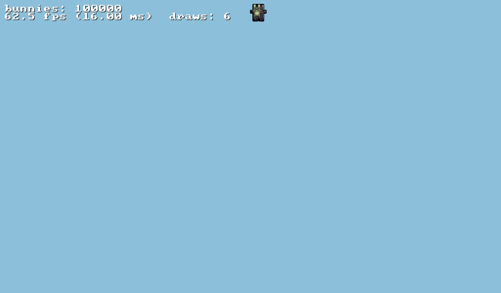

# core_gl

Lightweight OpenGL/OpenGL ES abstraction layer -- zero external deps,
cross-platform (Desktop GL 4.3+ and OpenGL ES 3.1/WebGL2).

A fast, low-level OpenGL render backend in C++11. No dependencies, no exceptions,
no smart pointers -- plain C-style API over a cached GL state machine. This is
**not** an engine: it is the backend an engine is built on.

```cpp
#include <coregl/gl_core.hpp>

gl::Renderer::Init(SDL_GL_GetProcAddress);  // or glfwGetProcAddress, eglGetProcAddress...

gl::Batch batch;
batch.Init(65535);
batch.SetProjection(ortho);                 // raw float[16], bring your own math

batch.SetColor(255, 80, 80, 255);
batch.Rect(40, 40, 120, 80);
batch.Text(40, 140, 16, "hello from the embedded font");
batch.Render();
```

## Demos

| Batch: shapes, text, transform stack | 3D: solids and wireframes |
|:---:|:---:|
|  |  |
| `test_window batch` | `test_window shapes3d` |

| Bunnymark: 100,000 sprites | Hardware occlusion query |
|:---:|:---:|
|  |  |
| `test_window bunny` | `test_window occlusion` |

Captured with the built-in recorder — press F10 during any test to start or
stop saving a GIF of the window (see `tests/gif_recorder.hpp`).

## Documentation

- **[Index](docs/INDEX.md)** — Main documentation page
- **[Building](docs/BUILDING.md)** — Prerequisites, build commands, platform notes
- **[API Reference](docs/API_REFERENCE.md)** — Complete class/method/enum reference
- **[Architecture](docs/ARCHITECTURE.md)** — State cache, uniform cache, lifetime management
- **[Tests](docs/TESTS.md)** — Available tests and how to run them
- **[Batch Shapes](docs/BATCH_SHAPES.md)** — Catalog of 2D and 3D drawing primitives
- **[Scene Nodes](docs/SCENE.md)** — Node hierarchy, scene graph, rendering pipeline, VFX, terrain, CSG, behaviors, math library

## Platforms

| Target        | API           | Status                                  |
|---------------|---------------|-----------------------------------------|
| Linux desktop | OpenGL 4.3+   | working (primary target)                |
| Android       | OpenGL ES 3.1 | compiles (`-DCORE_GL_FORCE_ES`)         |
| Web           | WebGL2/ES 3.0 | compiles; no compute/geometry           |
| macOS         | OpenGL 4.1    | untested; no compute                    |
| Windows       | --             | not yet (needs a runtime loader)        |


## What's inside

- **Renderer** -- central GL state cache: every state change and bind is compared
  against the cache and only reaches the driver when it actually changes.
  Stats for everything: draw calls, triangles, lines, binds, state changes.
- **Shader** -- vertex/geometry/fragment/compute. All active uniforms are
  introspected once at `Link()`; uniform lookups never touch the driver again.
  Hot path setters by location, convenience setters by name (FNV-1a hash).
- **Buffer / VertexArray** -- VBO, IBO (u16/u32), SSBO, UBO, instancing.
- **Texture / FrameBuffer** -- 2D, cubemap, depth, depth cubemap; MRT up to 16
  color attachments, depth-only mode for shadow maps.
- **Query** -- hardware occlusion queries (samples passed), timers, primitives.
- **Batch** -- indexed immediate-mode renderer:
  - 24-byte vertex (pos3f + uv2f + packed RGBA8), u16 indices
  - quads are 4 verts + 6 indices, circle fills are indexed fans
  - VBO/IBO orphaned per flush -- no driver sync stalls
  - consecutive draws with the same texture+mode merge into one call
  - transform stack (`PushMatrix`/`Translate`/`Rotate`/`Scale`)
  - 2D: rect, circle, ellipse, ring, arc, polygon, polyline, thick line, grid
  - 3D solids: cube, sphere, cylinder, capsule (flat color)
  - 3D wireframes: all of the above + 3D grid + axes
  - text with an embedded public-domain 8x8 font 
- **Lifetime** -- explicit `Release()` on every GL object;
  destructors are a safety net that never touch a dead context.

## Numbers (AMD Renoir iGPU, Mesa)

- **50,000 textured quads**: 3.5 ms CPU submit -- **14.3 M quads/s**
- **Bunnymark**: 100,000 bunnies at **90 fps**; 353k at 32 fps (fill-bound)
- 120 frames of a spinning triangle: **1** shader switch, **1** VAO switch

## Building

Requires CMake 3.16+ and SDL2 (tests only -- the library itself has zero deps).

```bash
cmake -B build && cmake --build build -j
./build/tests/test_window <test> [frames]
```

Run `./build/tests/test_window --help` for the full, current list of tests
and tutorials with a short description of each — see also
[docs/TESTS.md](docs/TESTS.md).
